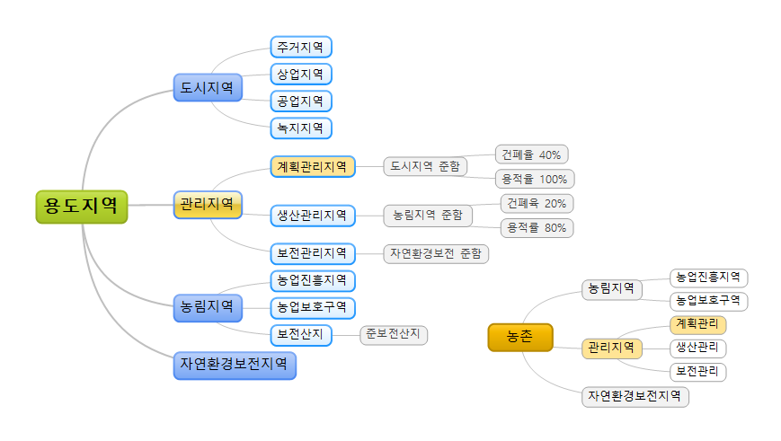

# Finance

금융, 부동산 등...

## 용도지역

국토의 계획 및 이용에 관한 법률에 의해 지정이 되어있다.

### 용도지역, 전 국토는 4개의 용도지역 중 하나

용도지역 다음은 머릿속에 넣어놓고 살자. 용도지역은 4개로 국토의 이용 및 계획에 의한 법률에서 정의하고 있다. 상식적으로 생각하면 된다. 크게 도시지역, 농림지역, 환경보전지역으로 나늬고, 도시지역과 기타 지역의 완충을 위하여 관리지역을 둬서 총 4개가 된다. 관리지역은 도시, 농림, 자연환경지역에 준하는 관리지역을 두는데, 이른 계획관리지역, 생산관리지역, 보전관리지역이라고 한다.

- 도시지역
- 관리지역
  - 계획관리
  - 생산관리
  - 보전관리
- 농림지역
  - 농업진흥
  - 농업보호
- 자연환경보전지역

### 시골땅은 주로 농림지역 아니면 관리지역

시골땅의 용도지역은 주로 관리지역 아니면, 농림지역 둘 중 하나다. 도시지역은 그야말로 도시지역에 있는 곳이고, 자연환경보전지역은 국립공원 같은 곳이다.

논, 밭, 임야 등 땅은 관리지역인지 농림지역인지 확인할 필요가 있다. 경지정리가 되어있다면 주로 농림지역이다. 

시골땅 같은 농림지역이나 생산관리지역일 수 있는데, 내 경우는 계획관리지역에 포함되어있다. 마을과 붙어있어서 그렇게 용도지역을 구분해놨다.

관리지역이라면 계획관리, 생산관리, 보전관리 등에 큰 차이 없이 집을 지을 수가 있다고 한다. 하지만 용적률 등에 따라 개발에는 차이가 있다.

