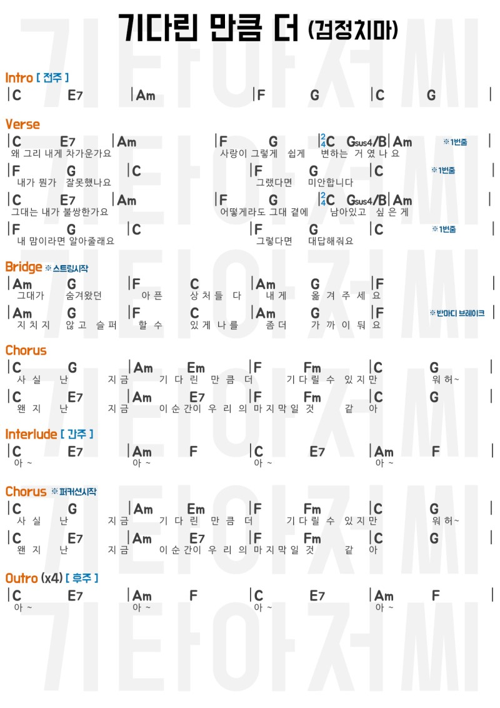

# 내가 좋아하는 음악

## Listening to music

내가 즐겨듣는 음악들 링크를 저장해 놓자. 듣고싶을 때 들을 수 있을 것이다.

처음으로 링크하기 예빛 사운드클라우드(https://soundcloud.com/yebit/popular-tracks)

사운드클라우드 앱 이용하기

그동안 통신사에서 무료로 제공하는 음악듣기 앱을 이용했으나, 통신사를 옮긴다든지, 로그인을 수시로 물어본다든지 해서 사운드클라우드로 갈아탔다. 스포티파이, flow, 그리고 엘지유플러스의 앱 등을 이용했는데, 쓰다보면 자꾸 귀찮은 일이 생긴다.

## Guitar

기타 플레이 링크를 저장해 두자. 언제든 찾아볼 수있게 말이다.

## Song

내가 부를 수 있는 노래 목록과 링크를 저장해 두자

### 기다린 만큼 더 (검정치마)

노래듣기 예빛 유튜브(https://youtu.be/i_bJwt7uTwQ) 사운드클라우드(https://soundcloud.com/yebit/cover-1)

https://youtu.be/i_bJwt7uTwQ

<iframe width="560" height="315" src="https://www.youtube.com/embed/i_bJwt7uTwQ" title="YouTube video player" frameborder="0" allow="accelerometer; autoplay; clipboard-write; encrypted-media; gyroscope; picture-in-picture" allowfullscreen></iframe>

