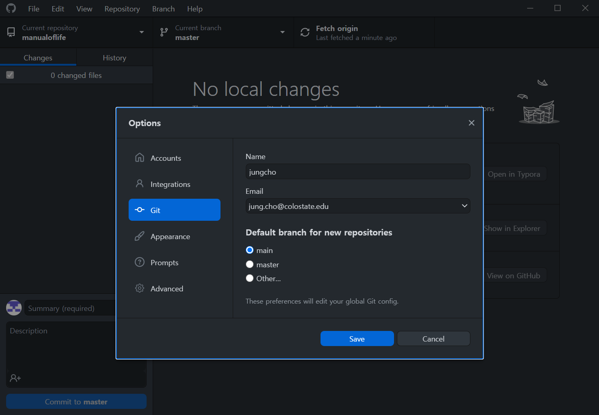

# GitBook을 이용한 책쓰기

## 절차

> * 세팅하기
> * 매일 매일의 루틴
> * 확인하기\(다시보기\)

이글을 쓰기 위한 절차

## Typora와 GitBook 글쓰기 자동 세팅하기

세팅하기는 앞장에서 설명을 했고, GitBook

GitHub와 GitBook은 어떻게 연계를 하는가?

모르겠으면 아래의 링크를 찾아간다. [https://www.youtube.com/watch?v=e9DMxI\_XOPI](https://www.youtube.com/watch?v=e9DMxI_XOPI)

GibBook 왼쪽 메뉴 Intergrations에서 GitHub를 클릭한다.

책을 쓸 때는 질문을 한다.

GitHub와 연결을 해봤다. 테스트해보

## GitBook과 GitHub 연결하기

깃북과 갓헙을 연결해야 될 것 같다. 왜냐하면, 그래야지 오프라인 노트북에서 글을 쓰고, 이 글을 온라인에 통합시킬 수 있을 것이다. 반대로 온라인에서 쓰고 오프라인에서 편집하는 것도 하나의 좋은 방법이 될 것 같다.

## 소소한 팁들

### 브랜치 충돌 문제해결

GitBook과 GitHub 연결하면서 브랜치때문에 골치가 아팠었다. 저장소를 처음 만들면 'master' 브랜치가 생긴다\(_맞는 지는 확인해 봐야 한다_\). GitBook은 기본적으로 'master' 브랜치만 이용한다. 깃허브는 'main'이 디폴트 브랜치다. main과 master를 유심히 보지 않은 것이 문제였다. 두개의 브랜치로 각각 저장이 되고있었다. 사실 이것이 유용하고 좋은 기능인데, 나는 이번에 처음 알게 되었다. 각각 진행한 문서를 한명이 요청하면 다른 사람이 검토해서 두 파일을 합치거나 하는 기능이다.

어떻게 이문제를 해결하였는가? 어렵게 어렵게 했는데, 결론은 간단하다. main을 master로 rename 하였다. main이 주로 내가 편집하던 것이고, master는 쓰레기글이 많아서, master를 지우고, 기존 main을 rename하였다.

main은 아마 GitBook Desktop 때문에 생긴 것 같다.

